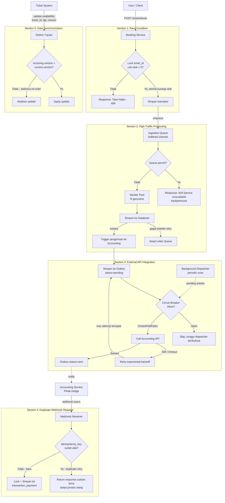

# Combined Flow Diagram — Ticket Booking System

Diagram ini menggabungkan kelima skenario (Section 1–5) menjadi satu flow
end-to-end: dari user book tiket, sistem menangani lonjakan traffic,
mengirim data ke accounting service pihak ketiga, menerima webhook payment,
dan menyinkronkan ketersediaan tiket ke sistem lain.

## Ringkasan alur per section

1. **Section 1 (Booking):** setiap request booking melewati critical
   section yang dilindungi lock per `ticket_id`, menjamin hanya satu
   pemenang saat stok = 1.
2. **Section 2 (Ingestion):** request masuk ke queue, di-ack cepat, lalu
   diproses asinkron oleh worker pool; backpressure mencegah overload.
3. **Section 3 (External):** transaksi sukses dicatat di outbox sebelum
   dikirim, dilindungi circuit breaker + retry, dispatcher background
   menjamin pengiriman akhirnya berhasil (at-least-once).
4. **Section 4 (Webhook):** idempotency key mencegah payload duplikat
   tersimpan dua kali walau diterima bersamaan.
5. **Section 5 (Sync):** version/sequence number memastikan update yang
   stale (out-of-order) tidak menimpa data yang lebih baru.
